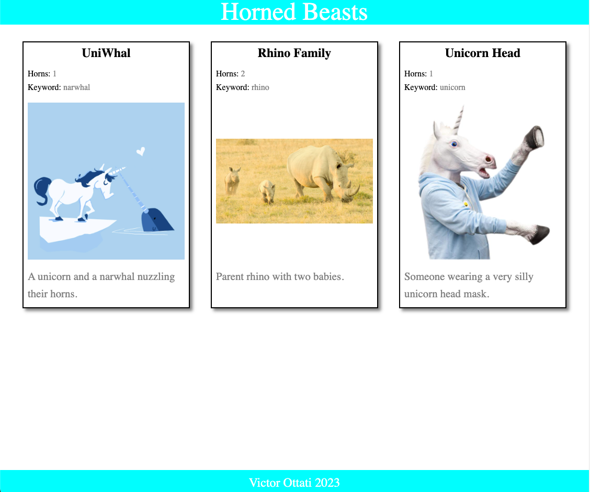

# Class 301 Lab 1

[REPO](https://github.com/VMO2020/horned-beast)

# Class 301 Lab 2

Number and name of feature:
. Add beasts.json
. Render using map function
. Add filter by number of horns

Estimate of time needed to complete: 2 h

Start time: 1:00 pm

Finish time: 2:35 pm

Actual time needed to complete: 2.35 h

## LinksNetlify Link

[web link](https://vmog-horned-beasts.netlify.app/)
